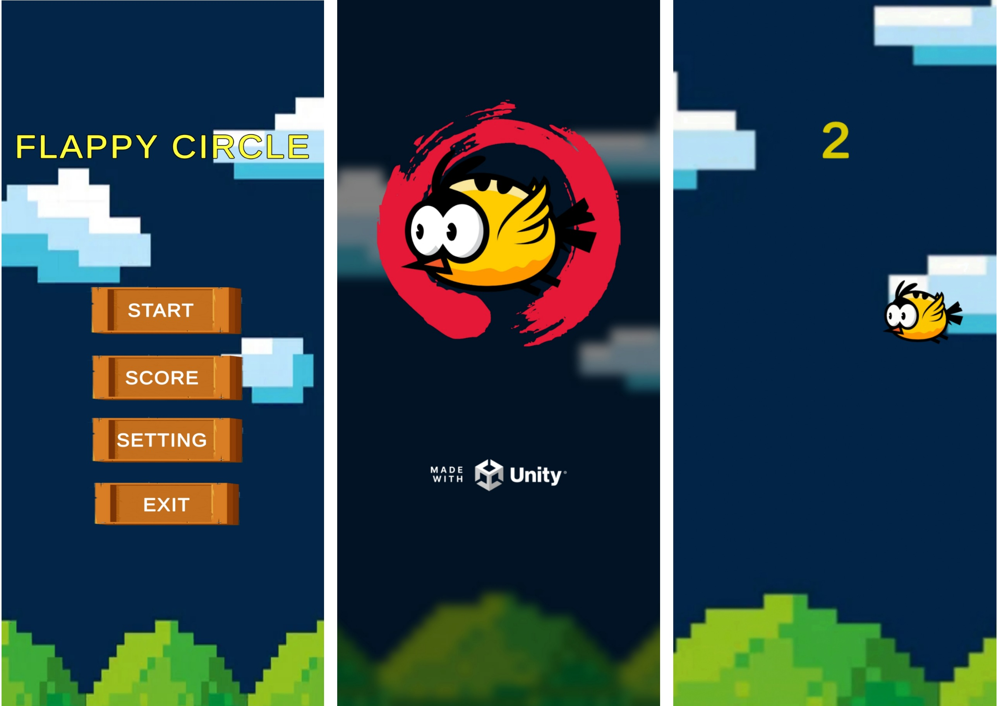
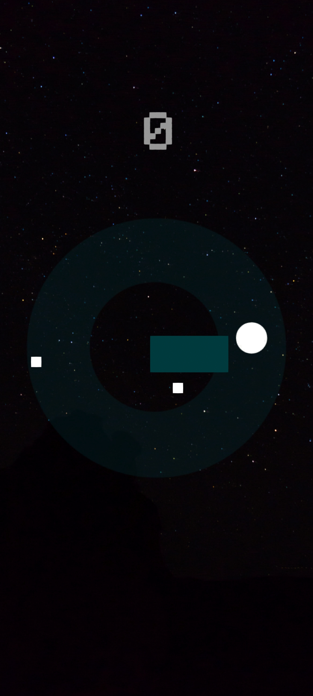
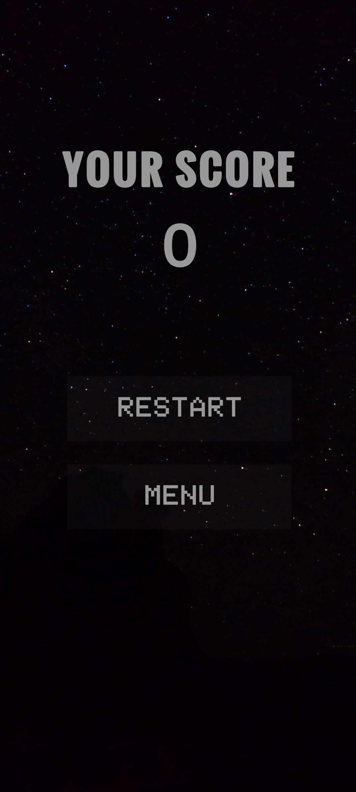

# Half Circle Unity

The game is created using the Unity Game Engine.
The Assets and Scripts used in the game are provided here,
and the Mega Link To Download the Game is given Below.

Link - 

What Is Used In The Game?
1. Unity Editor
2. Scene Management
3. Post Processing
4. C# language

Hope You All Enjoy The Game.

SCREENSHOTS:

 
 

